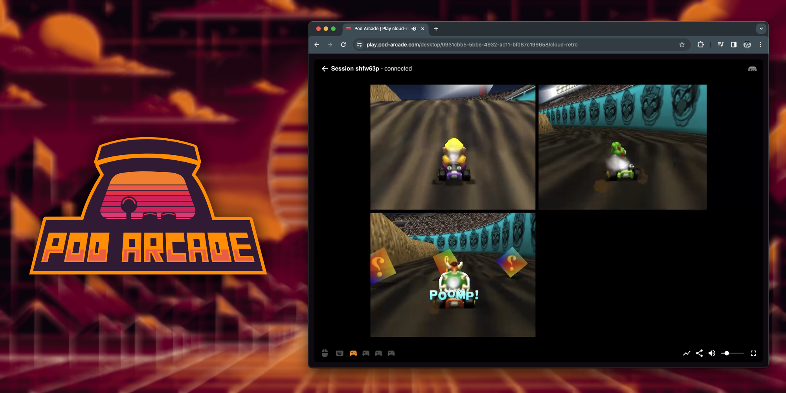

We are excited to announce the very first major release of Pod Arcade, an open source project that enables you to stream retro games via RetroArch or other compatible software directly to your browser using WebRTC. This project has been more than 6 months in the making and we are excited to finally share it with the world.

## What is Pod Arcade?

Pod Arcade is a project that lets you play your favorite games over the internet with your friends. Fundamentally it lets you stream any game that can run on Wayland, through WebRTC to any browser using WebRTC. Pod Arcade handles the logistics around input emulation and video streaming, so you can focus on playing your favorite games with your friends. The entire system is completely open source and built off of open source technologies and has been released under the permissive MIT license. You can find the source code for the project over on [GitHub](https://github.com/pod-arcade/pod-arcade).

It is important to note that Pod Arcade is not a game emulator. It is a tool that lets you stream games that are running on your computer to your friends. You will need to provide your own games and emulators. We recommend using RetroArch, but any emulator that can run on Wayland should work. We have a couple of apps that we have tried Pod Arcade out with in our example-app repository: [https://github.com/pod-arcade/example-apps](https://github.com/pod-arcade/example-apps).

## Announcing play.pod-arcade.com
Also as part of the v1 release, we are officially announcing [https://play.pod-arcade.com](https://play.pod-arcade.com). This is our official hosted instance of the Pod Arcade server component. By using play.pod-arcade.com you can spend less time setting up your own server and more time playing games with your friends.

This is a completely free service that we are offering to the community. We are currently running the server on limited hardware, so we ask that you please be patient with us as we work out any kinks in the system. We are also looking for volunteers to help us run more servers, so if you are interested in helping out, please reach out to us on [Discord](https://discord.gg/y8aasvEMy6).

## How to get started
To get started using Pod Arcade, check out our [Getting Started](/docs/intro) guide. This will walk you through setting up the Pod Arcade server component and connecting to your first Pod Arcade Desktop.

## What's next?
We're just getting started. We hope to hear your feedback about what you like and don't like about Pod Arcade. We have a couple ideas around some usability improvements to the Browser interface, and would really love to get this working on a Raspberry Pi environment. We are also looking for volunteers to try out different hardware and network configurations, so if you are interested in helping out, please hop on over to our [Discord](https://discord.gg/y8aasvEMy6). We are also looking for developers to help us improve the project. If you are interested in contributing, please check out our [GitHub](https://github.com/pod-arcade) page. If you are familiar with Linux, Wayland, Golang, WebRTC or React, we'd love any help you can give.

Finally, to close things out, we'd be remiss if we didn't thank the following projects for making Pod Arcade possible:
- [Games on Whales](https://github.com/games-on-whales) - specifically [ABeltramo](https://github.com/ABeltramo) and [Drakulix](https://github.com/Drakulix) for their help with gamepad emulation and Wayland architecture guidance
- [Pion](https://github.com/pion) - industry leading WebRTC library for Golang
- [Sway](https://github.com/swaywm/sway) - the best (and simplest) Wayland compositor