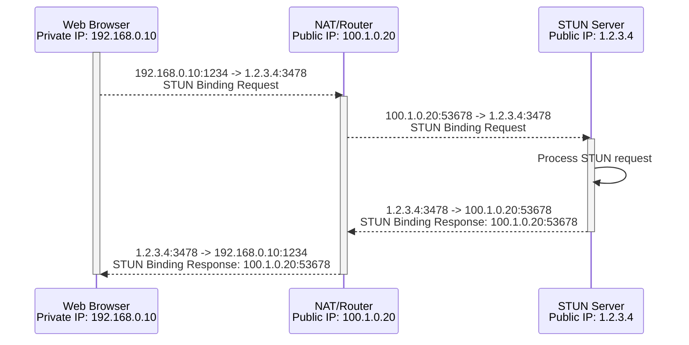
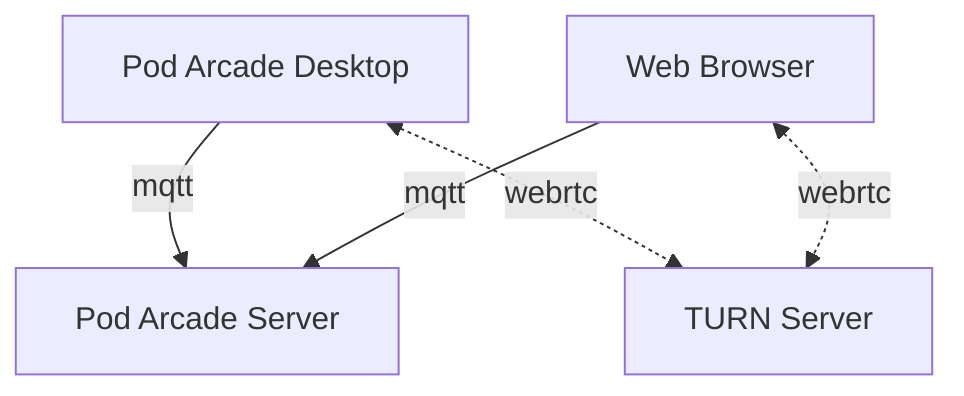
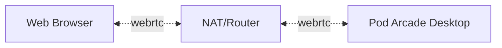

# Peer-to-Peer Connection
Having a strong peer-to-peer connection is crucial for a good Pod Arcade experience. This page will explain how Pod Arcade uses WebRTC to establish a peer-to-peer connection between the Desktop and the Browser, and what options you have available to improve your connection.

## ICE Servers
> ICE (Interactive Connectivity Establishment) is a framework used by WebRTC (among other technologies) for connecting two peers, regardless of network topology (usually for audio and video chat). This protocol lets two peers find and establish a connection with one another even though they may both be using Network Address Translator (NAT) to share a global IP address with other devices on their respective local networks.
>
> https://developer.mozilla.org/en-US/docs/Glossary/ICE


### STUN
STUN is an API used to obtain the IP address, port number, and connectivity status of a client running behind a firewall.



When a Client initiates a STUN request, it sends a Binding Request to the STUN server. The NAT/Router will then forward the request to the STUN server, which will respond with a Binding Response containing the public IP address and port number of the NAT/Router. The NAT/Router will then forward the Binding Response to the Client. The client now knows its public IP address and port number, which it can use to communicate with other clients.

:::warning
If your NAT/Router uses Symmetric NAT, it will require a different NAT entry for each destination IP address meaning a direct peer-to-peer connection will not be able to be established between two clients. In this case, you will need to use a TURN server.
:::

The Pod Arcade Server component includes a STUN server out of the box. If you are self hosting this component, consider not only port-forwarding the HTTP port, but also the STUN port. You can configure the STUN port using the `STUN_PORT` [environment variable](../configuration/server.md#server-configuration).

If you want to instead use a public STUN server, you can use the following configuration or replace it with any other STUN server of your choice. https://gist.github.com/zziuni/3741933 has a currated list of free STUN servers.

```json
[{"urls":["stun:stun.l.google.com:19302"]}]
```

### TURN
In the event that WebRTC is unable to establish a direct connection between the Desktop and the Browser, it will attempt to use a TURN server to relay the traffic. This is a last resort, as it will add latency to your Pod Arcade sessions. In this scenario, all traffic between the Desktop and the Browser will be routed through the TURN server.



The Pod Arcade Server component does not include a TURN server out of the box. You will need to run your own TURN server and configure it using the `ICE_SERVERS` [environment variable](../configuration/server.md#server-configuration).

During development, the Pod Arcade team used [Stunner](https://github.com/l7mp/stunner), a Kubernetes native STUN/TURN server. With that you can configure a static username and password and then configure the Pod Arcade Server component to use it like so:

```json
[
  {"urls":["stun:10.0.0.10:3478?transport=udp"]},
  {"urls":["turn:{{private_ip}}:3478?transport=udp","turn:{{public_ip}}:3478?transport=udp"],"username":"user-1","credential":"pass-1"}
]
```

## Port Forwarding
If none of the ICE methods work above, you will need to configure the Pod Arcade Desktop component with a static port number and then configure your router to forward that port to the Pod Arcade Desktop component. In this mode, all WebRTC connections will be established to a static port, allowing a direct peer-to-peer connection to be established.



You can configure the port number using the `WEBRTC_IPS` and `WEBRTC_PORT` [environment variables](../configuration/desktop.md#desktop-configuration). The `WEBRTC_IPS` variable should be set to the public IP address of your NAT/Router (and optionally the private IP address of the server the Desktop is running). The `WEBRTC_PORT` variable should be set to the port number you have port-forwarded through from your router.

:::info
The port number of the Pod Arcade Desktop component must be the same as the port number configured on your router in order for the configuration to work correctly.
:::

If you are running multiple Desktops in your network, you will need to configure each Desktop with a unique port number and configure your router to forward each port to the corresponding Desktop.