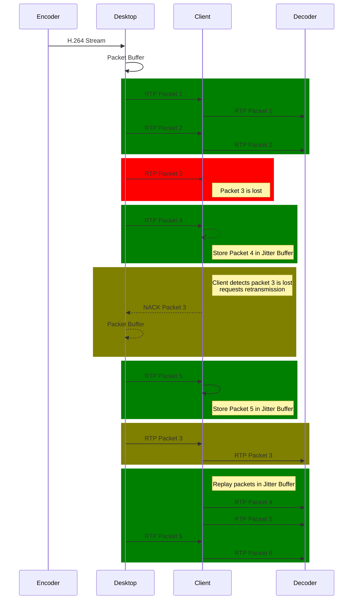

# Streaming

Pod Arcade uses WebRTC to stream video and audio between the Desktop and the Browser. This page will explain how Pod Arcade uses WebRTC to establish a peer-to-peer connection between the Desktop and the Browser, and what some of the design decisions were that influenced the implementation.

## Video Codecs
There are many great video codecs to choose from. Being that Pod Arcade is a game streaming platform, the most important factor is latency. The lower the latency, the better the experience. In order to get the lowest latency possible, we have to choose a codec that can be encoded and decoded using hardware acceleration. We also need to choose a codec that can be used by WebRTC in (most) browsers.

[RFC 7742](https://datatracker.ietf.org/doc/html/rfc7742) specifies that all WebRTC-compatible browsers must support VP8 and H.264's Constrained Baseline profile for video. Most devices already have H.264 hardware acceleration built in, and is supported by all major browsers so we will use H.264 for video.

| Codec | Encoding | Decoding | Compatibility | Compression |
| ----- | -------- | -------- | ------------- | ----------- |
| **H.264** | Hardware | Hardware | All Browsers  | Good        |
| **H.265** | Hardware | Hardware | Safari        | Great       |
| **VP8**   | Hardware | Hardware | All Browsers  | Poor        |
| **VP9**   | Hardware | Hardware | All Browsers  | Great       |
| **AV1**   | Software | Software | Chrome        | Amazing     |

H.265 is a great codec, but it is not supported by all browsers, specifically only supported by Safari. It is also not supported by all hardware, and the ecosystem around the codec is very proprietary and closed. For these reasons, we will not be using H.265.

VP9 is also a potential candidate, but hasn't been evaluated yet. This is the same codec used by most cloud game streaming services, so may provide a valid alternative to H.264 if the latency is low enough on lower-powered hardware.

And finally AV1 would be a perfect candidate for remote streaming, but encoding performance is still not great, and decoding performance is even worse. This codec will be re-evaluated in the future as more hardware support is added.

In the desktop application, video is captured using the [wf-recorder](https://github.com/ammen99/wf-recorder) and piped into Pod Arcade to be packetized and streamed via WebRTC. We hope in the future to migrate this over to Gstreamer to give us more control over the video stream, and allow us to have greater hardware compatibility.

## Packet loss
When designing Pod Arcade we had to be very considerate of packet loss throughout the whole process. Packet loss can occur at any point between the Desktop and the Browser, and can be caused by a number of different factors. The most common cause of packet loss is a poor WiFi connection, but it can also be caused by a poor internet connection, or even a poor connection between the Desktop and the Router.

Whenever a packet is lost, the video stream will freeze until the next packet is received. This can be very jarring and can ruin the experience. In order to mitigate this, WebRTC implements a feature called a Jitter Buffer. The Jitter Buffer will store a number of packets in memory, and will play them back in order, giving ample time for missed packets to be redelivered when it is lost. This will help smooth out the video stream, but will also add latency.

For systems like [Moonlight](https://moonlight-stream.org/), a jitter buffer is not used. Instead, there is a tighter integration between the streaming client and the video encoder, and whenever a packet is missed, the video encoder will generate a new IDR frame, which will allow the video stream to recover much faster. While overal latency is lower, during high packet loss this can cause the video stream to become very blocky and pixelated, or potentially even use more bandwidth, causing additional pressure to a system that is already losing packets.

We continue to evaluate the best way to handle packet loss, and may implement a similar feature in the future. In the meantime we are working with the WebRTC community to help improve the Jitter Buffer implementation and specifically make the delivery of these packets more robust to keep the latency as low as possible.

## Audio
Audio is streamed using the Opus codec. Opus is a great codec for streaming audio, and is supported by all major browsers. It is also supported by most hardware, and is very efficient. It is also a great codec for low-latency audio, which is crucial for a good gaming experience. The alternative to this is G.711, but in our testing has shown to have really low audio quality.

In the desktop application all audio is captured from the PulseAudio server using Gstreamer, which is then piped into Pod Arcade to be streamed to the browser.