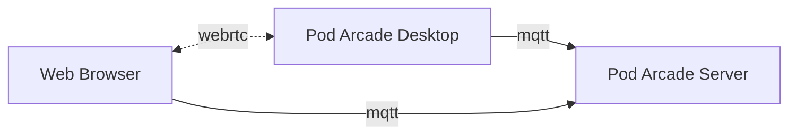

# Introduction

Pod Arcade is an open-source project that enables you to stream games via RetroArch or other compatible software, running on Wayland, directly to your web browser.

It is designed to be deployed on Kubernetes, but can also be deployed using Docker or any other container platform.

There are two major components to Pod Arcade:

- [Server](https://github.com/pod-arcade/pod-arcade/blob/main/cmd/server/main.go) — an MQTT server that manages the game streaming sessions. Desktops and web browsers connect to this server in order to stream games.
- [Desktop](https://github.com/pod-arcade/pod-arcade/blob/main/cmd/desktop/main.go) — a server that runs on Wayland which streams games to the web browser and emulates input devices.

All Pod Arcade communication between the Desktop component and the web browsers is done using WebRTC. WebRTC uses an algorithm called ICE to attempt to establish a direct connection between the Desktop and the Browser. In most cases, this will work without any additional configuration. However, if you are behind a firewall or NAT, you may need to configure your router to forward ports to your Pod Arcade server or add a TURN server to your Pod Arcade server configuration.